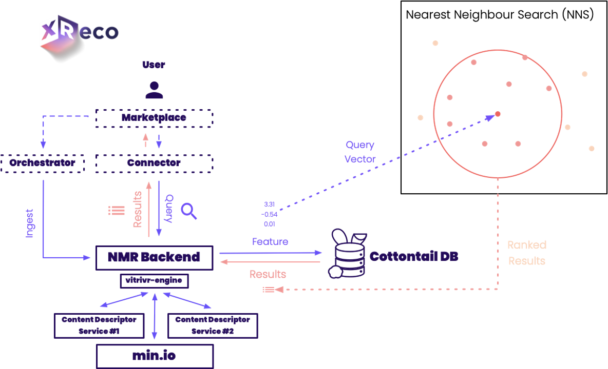

# XReco Neural Media Repository (NMR)

The NMR (Neural Media Repository) is a service to manage and search media assets efficiently. It is built as an extension of [vitrivr-engine](https://github.com/vitrivr/vitrivr-engine) and uses [Cottontail DB](https://github.com/vitrivr/cottontaildb) as its underlying database. The service at the University of Basel.




## Features

- **Asset Management:** Upload and store media assets into the local repository.
- **Search Functionality:** Efficiently search for media assets using various parameters.
- **Pipeline Customization:** Specify different features in the asset processing pipeline.
- **Integration with MinIO:** Store data on MinIO with configurable access and secret keys.

## Getting Started

To get started with NMR, follow these steps:

1. Clone the repository:

2. Set up MinIO:
    - Install MinIO and configure it with your desired settings.
    - Set the access and secret keys as environmental variables.

4. Build and run the backend:

6. Access the NMR API service in your browser:

    ```http
    http://localhost:7070
    ```
